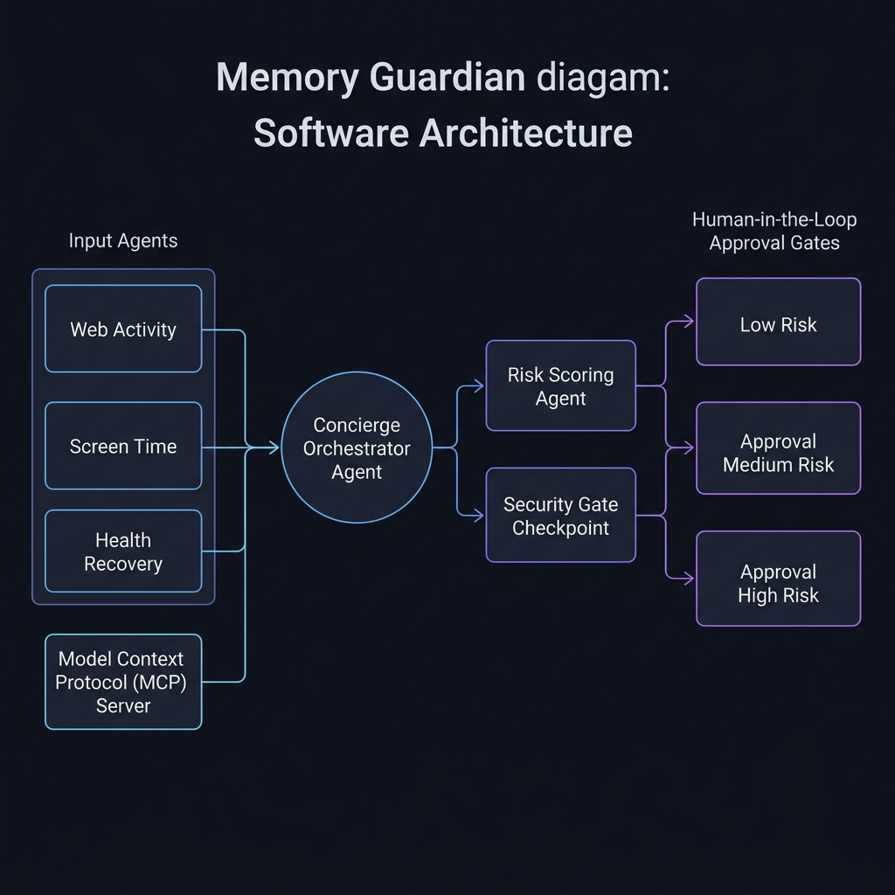

# Memory Guardian: Submission Writeup 🛡️


Memory Guardian is a safety-first, multi-agent AI solution designed to monitor digital lifestyle metrics and safeguard users from cognitive decline, mental fatigue, and long-term memory loss. The project is implemented using the **Google Agent Development Kit (ADK 2.0)** and the **Model Context Protocol (MCP)**.

---

## 1. Problem
In the modern digital environment, memory impairment and cognitive decline are increasingly driven by lifestyle factors:
* **Digital Habits & Web Activities**: The shift from active reading to passive, rapid web browsing (infinite-scroll feeds, high-stress news cycles) results in attention fragmentation and high cognitive load, draining executive function.
* **Sleep Duration & Quality**: Sleep duration directly correlates with cognitive health. During deep sleep, the glymphatic system flushes out metabolic waste, including beta-amyloid plaques. Insufficient sleep compromises memory consolidation and neurogenesis.
* **Physical Health & Burnout**: Prolonged screen time combined with low physical recovery and inadequate rest exacerbates mental fatigue, creating a feedback loop of chronic cognitive stress.

Memory Guardian bridges the gap between raw behavioral telemetry and actionable wellness insights by providing an automated risk scoring system backed by robust safety guardrails.

---

## 2. Architecture
The Memory Guardian workflow is built as a stateful directed graph utilizing the ADK 2.0 `Workflow` API:



1. **`data_router`**:
   Acts as a gateway. If telemetry data has not yet been collected (`data_gathered == False`), it routes the workflow to the `ConciergeAgent`. If telemetry is present, it routes to `memory_guard_agent`.
2. **`ConciergeAgent` (Orchestration)**:
   A central agent that parallelizes/delegates telemetry-gathering tasks to four upstream agents using `AgentTool` definitions:
   * **`WebActivityAnalyzer`**: Contacts the MCP server to retrieve web browsing duration and categories.
   * **`ScreenTimeAgent`**: Contacts the MCP server to retrieve total active screen time.
   * **`HealthRecoveryAgent`**: Contacts the MCP server to fetch sleep metrics (hours and sleep score).
   * **`RiskScoringAgent`**: Synthesizes the telemetry and applies the scoring logic via `set_risk_metrics`.
3. **`security_checkpoint` (Stateful Checkpoint)**:
   Intervenes immediately after telemetry calculation. It handles data sanitization (PII), security compliance, input range enforcement, and determines if a High Risk scenario requires Human-in-the-Loop approval.
4. **`mark_data_gathered`**:
   A node that marks `data_gathered = True` so that the router transitions the flow.
5. **`memory_guard_agent` (Finalization)**:
   The ultimate node that outputs the analysis summary and recommendations. It is restricted from invoking upstream tooling or accessing raw metrics directly.

---

## 3. ADK Concepts
Memory Guardian uses key abstractions provided by the Google ADK:

* **State Sharing (`MemoryGuardianState`)**:
  A schema-enforced Pydantic class that models the system state. All agents read from and write to this shared dictionary.
* **Workflow Graph**:
  Defined using `Workflow(name="memory_guardian_workflow", state_schema=MemoryGuardianState, edges=[...])` which connects nodes via transition paths.
* **Agent Tool Delegation**:
  Instead of writing custom API integration code, the `ConciergeAgent` relies on `AgentTool` instances representing the downstream specialized agents. The ADK's orchestrator handles routing requests between agents automatically.
* **Stateful Resumability**:
  Configured via `ResumabilityConfig(is_resumable=True)`. When the agent raises an interrupt, the ADK serializes the entire workflow execution state to the disk.
* **RequestInput & Checkpoint Approval**:
  When a high-risk score is calculated, the checkpoint returns a `RequestInput(interrupt_id="checkpoint_approval", response_schema=CheckpointApproval, message=...)`. This suspends the workflow and waits for resume input.

---

## 4. Security Design
Security and privacy are built into every node of the workflow:

1. **PII Redaction**:
   The `security_checkpoint` runs a regex-based `scrub_pii` utility on the user's `memory_text`. Any email addresses, phone numbers, and Social Security Numbers are automatically replaced with `[REDACTED]`.
2. **Prompt Injection Defense**:
   Before LLM processing, the input text is scanned for command-override patterns (e.g., "ignore previous instructions"). If detected, the workflow throws a `ValueError` and halts execution.
3. **Domain Constraint Checking**:
   The checkpoint validates bounds: age must be between 0 and 120, and telemetry hours must be non-negative.
4. **Risk-Based Threshold Gating**:
   * **Low Risk ($\le 50.0$)**: The checkpoint automatically grants approval (`approved = True`) and continues.
   * **Medium Risk ($50.0 < \text{score} \le 70.0$)**: Automatically approved, but prompts the user for a summary.
   * **High Risk ($> 70.0$)**: Halts execution. It requires explicit user interaction to approve the continuation.

---

## 5. MCP Tools
The application integrates with an external Model Context Protocol (MCP) server named `TelemetryServer`, implemented using `FastMCP`. The server exposes four tools:

1. `get_synthetic_web_metrics()`: Exposes browsing categories and duration.
2. `get_synthetic_screen_time()`: Exposes categorized screen use duration.
3. `get_synthetic_health_metrics()`: Exposes sleep hours and quality score.
4. `log_recommendation(recommendation)`: Allows the agent to log wellness recommendations back to the server console.

The server is connected using stdio:
```python
mcp_toolset = McpToolset(
    connection_params=StdioConnectionParams(
        server_params=StdioServerParameters(
            command="python",
            args=["-m", "app.mcp_server"],
        )
    )
)
```

---

## 6. HITL Flow
The Human-in-the-Loop (HITL) mechanism operates through the following steps:

```
[ConciergeAgent Evaluates Telemetry]
                |
                v
  [Is Risk Score > 70.0?]
     /             \
  (No)             (Yes)
   /                 \
[approved=True]    [Has user already approved?]
   /                  /                  \
  /                (Yes)                 (No)
 /                  /                      \
v                  v                        v
[Complete]   [Proceed]        [Raise RequestInput Checkpoint]
                                            |
                                            v
                                 [State Saved to Disk]
                                            |
                                            v
                                 [Wait for Resume Input]
                                            |
                                            v
                                 [User submits Approval]
                                            |
                                            v
                                 [Reload State & Resume]
                                            |
                                            v
                                     [approved = True]
```

When execution pauses, the runner provides the user with an input prompt. The user resumes the workflow by submitting a response complying with the `CheckpointApproval` schema (e.g., `{"approved": true}`).

---

## 7. Demo Walkthrough
A normal run proceeds as follows:

### Step 1: Initialization
The workflow starts, and the `data_router` routes the user query to the `ConciergeAgent` to acquire telemetry data.

### Step 2: Telemetry & Calculation
The `ConciergeAgent` calls `WebActivityAnalyzer`, `ScreenTimeAgent`, and `HealthRecoveryAgent` in sequence. They fetch details from the MCP Server:
* Web hours: $2.0\text{ hrs}$
* Screen hours: $4.0\text{ hrs}$
* Sleep score: $65.0$

The `RiskScoringAgent` calculates the overall risk score:
$$\text{Risk Score} = (100.0 - 65.0) + (4.0 \times 5.0) + (2.0 \times 5.0) = 35.0 + 20.0 + 10.0 = 65.0$$

The risk score of $65.0$ is classified as **Medium**.

### Step 3: Checkpoint Gating
At `security_checkpoint`, the score is $65.0 \le 70.0$. The workflow automatically marks `approved = True` and transitions to `mark_data_gathered`.

### Step 4: Final Summary
The `data_router` now directs the workflow to the `memory_guard_agent`, which generates a personalized health summary advising the user on screen time reduction and sleep habits, then completes.

*(Note: If the sleep score was lower, e.g., $40.0$, the risk score would rise to $90.0$, halting the agent at Step 3 until the user inputs `{"approved": true}`).*

---

## 8. Value
* **Actionable Wellness Insights**: Translates raw digital metrics into clear risk scores, helping users recognize high-stress patterns.
* **Privacy-First AI**: Scrubs PII before processing and runs fully local or secure cloud validations, ensuring user data safety.
* **Robust Orchestration**: By separating telemetry collectors from risk calculation and final summaries, the architecture avoids prompt bloat and guarantees deterministic safety checks.
* **Fault-Tolerant Resumability**: Enables stateful interrupts that allow long-term monitoring apps to sleep and wake up based on user confirmation.
